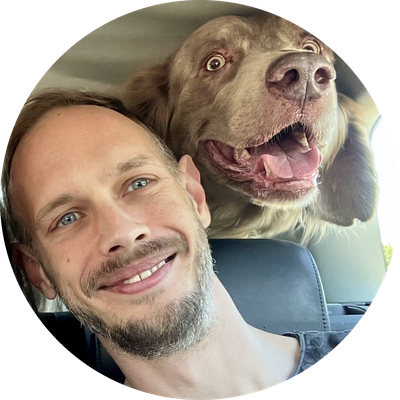

  

<h1 align="center">Hi, I'm Ondrej 👋</h1>

I help businesses get the most out of their Apple devices. For more than 15 years I have worked with Macs, iPhones and iPads at work, from small offices with a handful of devices to enterprise and banking fleets with thousands.

What I enjoy most is making device management feel invisible: new starters unbox a Mac and it is ready, updates arrive on time, and IT teams spend their days on real work instead of chasing settings.

### What I work with
- **Device management:** Jamf Pro, Automated Device Enrollment, Apple Business Manager, configuration profiles and policies
- **Apple platforms:** macOS, iOS and iPadOS, from hardware and support through to fleet architecture
- **Automation:** Jamf Pro API, zsh and bash scripting

### Certifications
Jamf Certified Admin · Jamf Certified Tech · Apple Certified Trainer

### How I can help
Whether you are rolling out your first ten Macs or tidying up a fleet of thousands, I am happy to help with Jamf Pro setup and management, fleet reviews, migrations, or simply a second opinion.

### Get in touch
📍 Prague, Czech Republic 
🏢 Inalogy 
💼 [LinkedIn](https://www.linkedin.com/in/ondrejjariabka)

The public repositories here are personal projects: Linux desktop theming and Nord colour schemes. The dog in the photo is Darwin, my usual travel companion.
